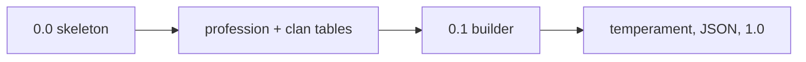

# Roadmap

Archetypes maps **preset ids** into Personality Engine compositions. Direction only — not a contract. Patch releases fix docs and presets without schema breaks.

Current status: **0.1 builder** on top of profession and clan catalogs. `MindPreset` is inferred from those tables; `PresetBuilder` builds an `AffectEngine`. Temperament, embedded JSON, and a schema freeze are later.

Personality Engine home: https://github.com/RossSim/personality-engine

## Sequencing (catalog-first)

Author profession and clan **tables** (fiction / knobs / citations) before locking `MindPreset`. Version numbers below are later intent, not the next coding slice.

## Intended versions

| Version | What a host would get |
| --- | --- |
| 0.0 | README, charter, roadmap, design, disclaimer, repo layout |
| 0.1 | Profession + clan tables; `MindPreset` / `PresetBuilder` → `AffectEngine`; tests against smith, scout, clerk, Philobrain, Trog |
| later | Temperament catalog (Thomas & Chess bands) + jitter |
| later | Embedded JSON presets + `docs/CITATIONS.md` per knob |
| 1.0 | Frozen `MindPreset` schema and builder contract; NuGet `Archetypes.Core` |

Do not invent knobs Personality Engine cannot consume yet. Embedded JSON is later.

## Depends on Personality Engine

| PE capability | Archetypes use |
| --- | --- |
| `OceanTraits`, compositions | Trait bands in presets |
| Piaget `CognitiveStage` | Clan cognitive architecture |
| Skinner operant bags | Profession training history |
| Optional layers | Preset lists which providers to enable |
| Future: Holland RIASEC, Sternberg domains | Vocation and ability presets when PE ships providers |

Track PE provider work in the personality-engine repo and its private tracker. This repo consumes PE APIs only.

## Not on this roadmap

- Real-world race, ethnicity, or national cognitive rank tables
- IQ, g, or WAIS-style composite scores
- MBTI or four-letter type inventories
- New affect providers (file those in personality-engine)
- Unity samples (games reference both packages when they exist)

## Controversy guardrails (product)

- Public catalog: fantasy clans and generic professions only
- Every preset documents **per-knob** citations in fiction vs science sections
- Ability differences = structure + training + trait bands, not “less intelligent people”

See [Charter](CHARTER.md) and [Design](DESIGN.md).
